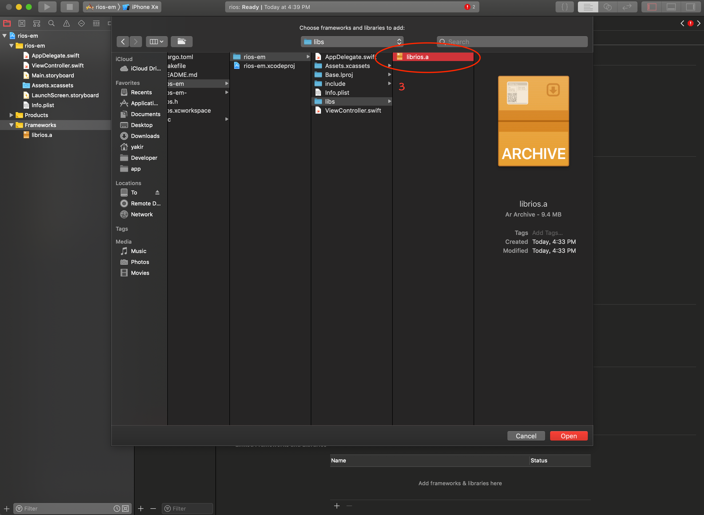

# iOS Swift 桥接 Rust

[Rust on iOS](https://medium.com/visly/rust-on-ios-39f799b3c1dd)

## Pre

```bash
cargo install cargo-lipo
cargo install cbindgen

rustup target add aarch64-apple-ios
rustup target add x86_64-apple-ios
```


## Build

```bash
cd rios

cargo lipo --release
cbindgen src/lib.rs -l c > rios.h


mkdir -p rios-em/rios-em/{include,libs}
cp rios.h rios-em/rios-em/include
cp target/universal/release/librios.a rios-em/rios-em/libs
```




